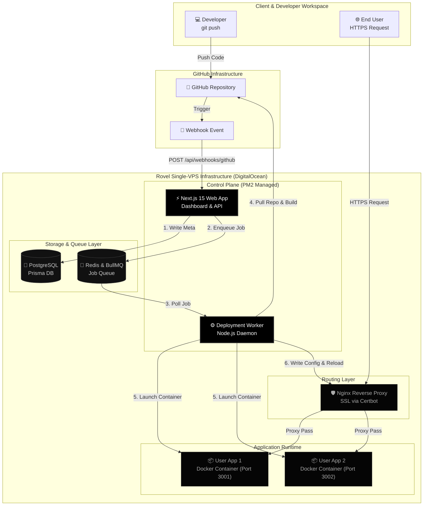

# Rovel

<p align="center">
  
  
  
  
  
</p>

Rovel is a self-hosted, lightweight Platform-as-a-Service (PaaS) inspired by Vercel and Render. It provides a zero-config, push-to-deploy developer experience running entirely on your own single VPS. Rovel automates the entire lifecycle of cloning, building, isolating (Docker), securing (wildcard SSL), and routing (Nginx) your applications.

---

## ✨ Key Features & Platform Upgrades

In addition to its core PaaS capabilities, Rovel includes several production-grade features and developer-experience enhancements:

* **Vercel-like Automated GitOps Webhooks**: Registers repository push webhooks automatically via secure cookie-based GitHub OAuth tokens, enabling instant zero-downtime redeployments on every git push.
* **Subdirectory & Monorepo Deployments**: Allows targeting nested directories (e.g., `apps/web` or `packages/frontend`) for framework detection, build context isolation, and Docker containerization.
* **Secure Admin Portal (`/admin`)**: A restricted management dashboard gated to authorized operators (`atharvabaodhankar`). Features live system telemetry, global project/user directories, remote container power controls (start, stop, restart, delete), and interactive Docker pruning logs.
* **Premium Theme & Custom Components**: High-fidelity dark developer theme with an interactive scanline landing page, custom search-filterable React Combobox inputs, and robust client-side rendering protection.

> [!NOTE]
> For an in-depth breakdown of every capability, implementation detail, and security guardrail, see the dedicated [FEATURES.md](FEATURES.md) guide.

---

## 🏗️ Core Architecture

Rovel uses a decoupled, event-driven architecture to coordinate between the Next.js web console and the background execution workers. This ensures the web UI remains fast and responsive while heavy container builds run safely in a managed queue.



---

## 📊 Framework Support Matrix

Rovel automatically inspects your repository, detects the framework, generates an optimized Dockerfile, and provisions the routing configurations.

| Framework | Detection Signatures | Containerization Method | Default Port |
| :--- | :--- | :--- | :--- |
| **React (Vite)** | `package.json` with `react`/`react-dom` + `vite` | **Multi-Stage Build**: Compiles Vite assets, copies `dist` to a lightweight `nginx:alpine` image. | `80` (internal) |
| **Vanilla Static** | `index.html` at the repository root | **Single-Stage Build**: Copies files directly to a lightweight `nginx:alpine` image. No Node.js build overhead. | `80` (internal) |
| **Next.js** | `package.json` with `next` | **Production Node Build**: Installs dependencies, compiles Next.js pages, starts server (`next start`) on `node:20-alpine`. | `3000` (internal) |
| **Express.js** | `package.json` with `express` | **Node Production Server**: Installs dependencies and boots the server (`npm start`) on `node:20-alpine`. | `3000` (internal) |

> [!TIP]
> **Subdirectory Deployments**: If your application is located in a nested subdirectory (e.g. inside a monorepo structure), Rovel will isolate the build context to that folder, execute auto-detection locally, and run the container build scoped to that directory path.

---

## 🛠️ Technology Deep-Dive: What, How, and Why

Rovel is organized as a modular npm monorepo utilizing workspaces to isolate packages, speed up compilation times, and share libraries across workspaces.

### ⚡ Control Plane: Next.js 15, TypeScript & Tailwind CSS
* **What**: Next.js 15 App Router, TypeScript, and a high-contrast monochrome Tailwind CSS UI.
* **How**: Houses the developer dashboard, JWT-based GitHub OAuth routes, cascades project deletions (terminating active Docker containers), and streams live build terminal logs.
* **Why**: Next.js 15 provides excellent server-side rendering (SSR) for session verification, high-performance static optimization for the dashboard, and clean API handlers. The monochrome theme delivers a premium, distraction-free, terminal-style interface for developers.

### 🐘 Database Schema: PostgreSQL & Prisma ORM
* **What**: PostgreSQL database combined with Prisma Object-Relational Mapping (ORM).
* **How**: Persists models for `User` (OAuth profiles), `Project` (metadata, slugs, frameworks, and host ports), `Deployment` (execution logs and status records), and `EnvironmentVariable` (stored encrypted).
* **Why**: PostgreSQL provides reliable ACID transactions, which are essential when mapping users to their respective projects and deployments. Prisma exports a type-safe client shared directly between the web API and the background worker, eliminating database query errors.

### 🔴 Job Queue: Redis & BullMQ
* **What**: Redis in-memory cache backing a BullMQ message queue.
* **How**: The Next.js API enqueues build jobs lazily. This lazy-loading pattern prevents establishing unnecessary Redis connections during Next.js static build times. The background worker polls jobs sequentially.
* **Why**: Docker image builds and repository clones are highly resource-intensive tasks. Moving these operations into a persistent queue prevents HTTP request timeouts, protects the VPS CPU from spiking under concurrent deployments, and allows streaming logs in real-time.

### 📦 Containerization: Docker Engine (Official CE)
* **What**: Docker Community Edition container runtime.
* **How**: Clones the codebase, generates an optimized `Dockerfile` dynamically, runs `docker build`, and launches the container. Deployed containers are secured with strict resource limits:
  * **Memory Limit**: `512MB`
  * **CPU Allocation**: `0.5 vCPU`
  * **Disk Protection**: Automatically runs `docker image prune -f` after builds and queries the DB to delete obsolete older deployment images.
* **Why**: Docker provides process isolation and sandboxing. Restricting CPU and RAM ensures that a single misconfigured user application cannot crash the host VPS or impact neighbor deployments.

### 🛡️ Routing & SSL: Nginx, Certbot & Wildcard Certificates
* **What**: Nginx reverse proxy secured by a Let's Encrypt Wildcard Certificate (`*.apps.domain`).
* **How**: The worker dynamically writes Nginx configurations at `/etc/nginx/sites-enabled/<project-slug>.conf` mapping the subdomain (e.g. `test-api.apps.domain`) to the allocated host port, and reloads Nginx via a passwordless sudoers rule. The worker automatically detects the wildcard certificate on the host to configure HTTPS (port `443`) and HTTP-to-HTTPS redirects.
* **Why**: Nginx serves as the secure entry point of the VPS, keeping internal application ports (`3001-9999`) safely hidden behind the firewall. A wildcard SSL certificate allows securing an infinite number of subdomains instantly without hitting Let's Encrypt rate limits.

### 🔗 Vercel-like Automated Webhook Deployments
* **What**: Secure, session-based webhook automation using cookie-persisted GitHub OAuth tokens.
* **How**: When a project is created, the system fetches the OAuth token securely via an encrypted cookie, dynamically resolves the webhook URL (supporting localhost development tunnels as well as production setups), and calls the GitHub Hooks API to register a push webhook.
* **Why**: Delivers a fully automated developer flow without requiring manual token database records or tedious manual repository configurations.

### 🛡️ Secure Admin Portal & Operator Toolkit
* **What**: An administrator dashboard gated strictly to the username configured in `ADMIN_USERNAMES` (default: `atharvabaodhankar`).
* **How**: Combines API-level security checks with a UI containing system telemetry (CPU, RAM, disk, container counts), global user/project directories, active container management actions, and an SSE-powered streaming Docker pruning terminal.
* **Why**: Empowers platform operators to audit resource consumption, manage hosted projects, and clean up server disk space without SSH access.

---

## 🔒 Production Hardening & Security

Rovel is built with strict security practices to ensure host stability and data privacy:

> [!IMPORTANT]
> **Environment Variable Encryption (AES-256-GCM)**:
> All user-defined environment variables (like database credentials, APIs keys, etc.) are encrypted before being written to the PostgreSQL database. Rovel uses a shared library (`packages/shared`) implementing Node's native `crypto` module (AES-256-GCM) combined with a SHA-256 key derivation function. Deployed containers only receive the decrypted values at container boot time.

> [!WARNING]
> **Host Port Isolation (Firewall)**:
> Although user applications are bound to host ports in the `3001–9999` range, the VPS firewall (`ufw`) blocks all external public access to this port range. The only way to access a user application is through the Nginx reverse proxy, which acts as the secure gatekeeper.

---

## 🔄 Continuous Delivery (CD) Pipelines

Rovel implements a dual-pipeline CD model:

### 1. User Application CD (Automatic Webhooks)
```text
[ Developer runs: git push ] ──► [ GitHub Webhook POST ] ──► [ Rovel API ] ──► [ BullMQ Queue ] ──► [ Worker Rebuilds Container ]
```
Once configured, pushing code to your application's GitHub repository instantly triggers a background build. Rovel compiles the new code, starts the new container, swaps the Nginx routing targets, and shuts down the old container, achieving a zero-downtime redeployment.

### 2. Rovel Platform CD (GitHub Actions & PM2)
The Rovel platform itself is fully automated via GitHub Actions:
1. Pushing to the `main` branch of the Rovel repository triggers the `.github/workflows/deploy.yml` workflow.
2. The runner connects to the production VPS via SSH using an authorized private key secret (`VPS_SSH_KEY`).
3. The runner executes the `./update.sh` script, which pulls the latest platform code, installs npm packages, runs Prisma database migrations, rebuilds Next.js and the worker, and restarts all services under the **PM2** process manager.
